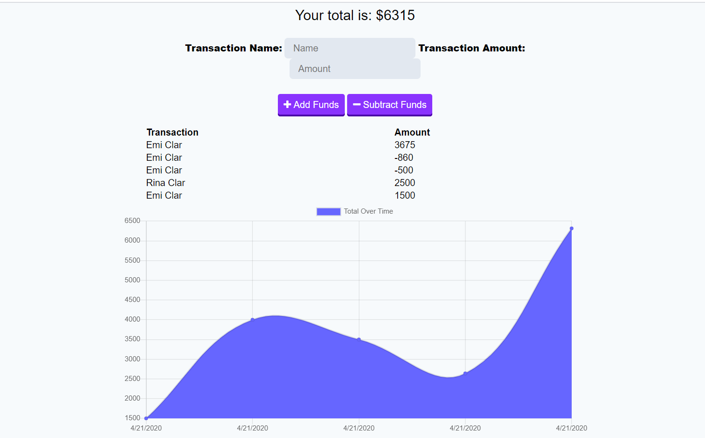

# Budget-Trackers
This is a Budget Tracker application that lets users add expenses and deposits to their budget with or without a connection.

### Table of Contents
* General Info
* Deployed Link
* Technologies

### General Info
The user will be able to add expenses and deposits to their budget with or without a connection. When entering transactions offline, they should populate the total when brought back online.

* Offline Functionality:

    Enter deposits offline

    Enter expenses offline

* When brought back online:

    Offline entries should be added to tracker.

### Deployed Link
[Click here to use the Budget Tracker app](https://blooming-fortress-32592.herokuapp.com/)

### Technologies
* JavaScript
* Node Js
* Express
* MongoDB
* Mongoose